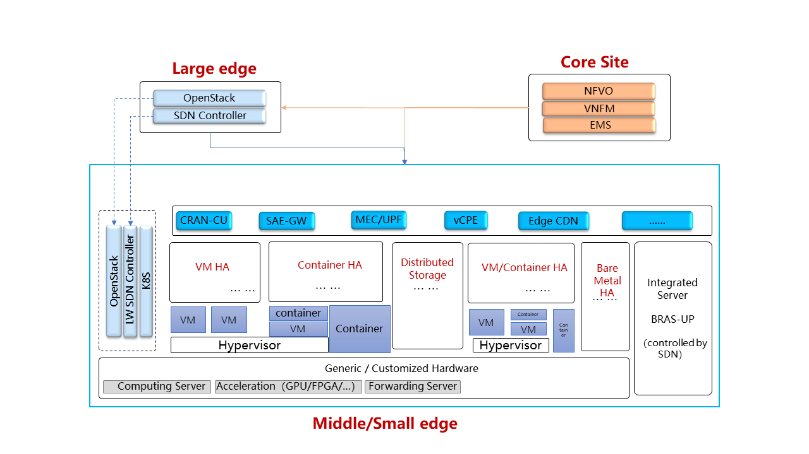

.. This work is licensed under a Creative Commons Attribution 4.0 International License.
.. http://creativecommons.org/licenses/by/4.0
.. (c) Open Platform for NFV Project, Inc. and its contributors

============
Introduction
============

This Edge Cloud Requirement Document is used for eliciting Edge Cloud
Requirements of OPNFV. This document will define high-level Edge Cloud goals,
including service reqirements, sites conditions, and translate them into
detailed requirements on edge cloud infrastructure components. Moreover,
this document can be used as reference for edge cloud testing scenario design.

.. _definitions:

===========================
Definitions & Terminologies
===========================

The following terminologies will be used in this document:

**Core site(s)**: Sites that are far away from end users/ base stations,
completely virtualized, and mainly host control domain services (e.g. telco
services: HSS, MME, IMS, EPC, etc).

**Edge site(s)**: Sites that are closer to end users/ base stations, and mainly
host control and compute services.

**E2E delay**: time of the transmission process between the user equipment and
the edge cloud site. It contains four parts: time of radio transmission, time
of optical fiber transmission, time of GW forwarding, and time of VM forwarding.

**BBU**: Building Baseband Unit. It's a centralized processing unit of radio
signals. Together with RRU (Remote Radio Unit), it forms the distirbuted
base station architecture. For example, a large stadium is usually separated
into different districts. Each district would be provided with a RRU, which
is close to user, to provide radio access. All RRUs would be linked to a BBU,
which is located inside a remote site away from user and provide signal
processing, using optical fiber.

**UPF**: User Port Function, which is a user plane gateway for user
data transmission.

**SAE-GW**: SAE stands for System Architecture Evolution, which is the core
network architecture of 3GPP's LTE wireless communication standard. SAE-GW
includes Serving Gateway and PDN Gateway. Serving Gateway (SGW) routes and
forwards user data packets,and also acts as the mobility anchor for LTE and
other 3GPP technologies. PDN Gateway (PGW) provides connectivity from the UE
to external packet data networks by being the point of exit and entry of
traffic for the UE.

SAE-GW related definition link: https://en.wikipedia.org/wiki/System_Architecture_Evolution

**CPE**: In telecommunications, a customer-premises equipment or
customer-provided equipment (CPE) is any terminal and associated equipment
located at a subscriber's premises and connected with a carrier's telecommunication
circuit. CPE generally refers to devices such as telephones, routers, network
switches, residential gateways (RG), home networking adapters and Internet
access gateways that enable consumers to access communications service providers'
services and distribute them around their house via a local area network (LAN).

CPE definition: https://en.wikipedia.org/wiki/Customer-premises_equipment

**enterprise vCPE**: Usually CPE provides a number of network functions such
as firewall, access control, policy management and discovering/connecting
devices at home. enterprise vCPE stands for virtual CPE for enterprise, which
is a software framework that virtualizes several CPE funcitons.

============================
Telco related Edge Use Cases
============================

**RAN Services:**  CRAN-CU

CRAN OPNFV project link: https://wiki.opnfv.org/pages/viewpage.action?pageId=20743420

CRAN stands for Cloud Radio Access Network or Centralized Radio Access Network.
The basic concept is to consolidate compute resources to run some radio access
functions virtually and remotely in a datacenter, rather than in a base station.
CU stands for Centralized Unit, which holds the non-real-time protocol processing
function of BBU (refer to :ref:`definitions`) and supports the deployment of some
functions of core networks.
Its generic requirements are listed below:

- CRAN-CU has strict timing and performance requirements for signal processing
  to be compliant with RAN standards. The E2E delay should be less than 3ms.

- Required bandwidth of CRAN-CU is around 50 GB/s

- Acceleration technologies are recommended. Different technologies would be used
  under different deployment scenarios, different use cases and etc.

- No external storage is needed by CRAN-CU. Local disk is enough.

**Gateways:** UPF, SAE-GW, enterprise vCPE (refer to :ref:`definitions`)

Gateway services like UPF, SAE-GW and enterprise vCPE used to be deployed
in core sites. They usually do not have strict latency requirements. Latency
requirements of UPF and SAE-GW are both 10ms. Minimum latency required by
enterprise vCPE is around 50ms when transmitting video and voice data. The number
is over a second if transmitting email. So latency requirements can always be
satisfied theoretically. However, as these gateways usually serve over millions
of users (every enterprise vCPE serves more than a thousand enterprise-level users),
they have high throughput requirements: bandwidth (BW) of UPF > 300 GB/s, BW of
SAE-GW is around 50 GB/s, BW of enterprise vCPE > 40 GB/s. Deploying these services
separately in edge sites will help to achieve local data flow transmission,
offload traffic flows from core networks, and reduce footprints of transmission
resources and core computing resources.

**Access technology independent service:** edge CDN

According to China Mobile’s data, every CDN unit can serve over 10 thousand
customers and it requires bandwidth over one hundred GB. In order to reduce
footprints of transmission resources and burden of the network, CDN is recommended
to be deployed in edge sites, but not too close to users if taking deployment cost
into consideration. It also requires fast compute ability to generate content
distribution strategy quickly.

One edge CDN unit does not need to communicate with other edge CDN units at the
same level, but need to be connected with CDN units at higher level for policy
distribution and resource downloading.

**MEC/Edge Computing Services**

Besides requiring low-latency, high-bandwidth, and high reliability, newly
generated edge computing services require the local deployment environment
to be capable of doing fast computing to support some intelligence functions
like real-time data analysis and optimal path calculation of services like V2X.
The deployment of MEC and third-party applications running on it mainly depends
on latency requirements. uRLLC requires E2E delay less than 3ms, which means it
should be deployed at edge sites close to base station. eMBB requires E2E delay
less than 10ms, which leads to more flexible deployment location.

Unlike traditional telco services which have relatively stable on-line and update
cycle, MEC and the third-party applications have more flexible lifecycle, which
means a more flexible infrastructure should be used such as container.

The table below summarizes the latency and bandwidth requirements of several
typical telco related services:( x in table stands for 1~5)

+------------+------------+-----------------+-------------+-----------+----------------------------+-------------+
| Service    | CND        | enterprise vCPE | SAE-GW      | 5G-UPF    | MEC                        | CRAN-CU     |
+------------+------------+-----------------+-------------+-----------+----------------------------+-------------+
| E2E delay  |   10 ms    | 50 ms           | 10 ms       | 10ms      | URLLC < 3 ms, eMBB < 10 ms | 3 ms        |
+------------+------------+-----------------+-------------+-----------+----------------------------+-------------+
| Bandwidth  | >100 GB/s  | 10 * x GB/s     | 10 * x GB/s | >300 GB/s | 10 * x GB/s                | 10 * x GB/s |
+------------+------------+-----------------+-------------+-----------+----------------------------+-------------+

================
Features of Edge
================

Lighter weight control
======================

As space and power resources are limited in edge sites and edge usually has
fewer number of servers (the number varies from a few to several dozens), it is
unnecessary to deploy orchestrator or VNFM. VIM (e.g.: OpenStack or Kubernetes)
and SDN would be deployed in light weight manner to save resources for services.
Detailed functions of light weight VIM and SDN have not been discussed yet,
but basic functions such as VM lifecycle management and automatic network
management should be persisted.

Remote provisioning

Resource diversity
==================

With various applications running on edge, diverse resources, including
VM, container and bare-metal could co-exist and form diverse resource pool.
These resources should be managed by edge management components as well as core
orchestration/management components.

Hardware/Software acceleration
==============================

Edge services usually require strict low latency, high bandwidth, and fast
computing and processing ability. Acceleration technology should be used in
edge to maintain good service performance. OpenStack should fully expose these
acceleration capabilities to services. The usage of different acceleration
technologies (including DPDK, SR-IOV, GPU, Smart NIC, FPGA and etc.) varies
from service to service.

Related project about acceleration: https://wiki.openstack.org/wiki/Cyborg

===========================================
Edge Sites Conditions/ Deployment Scenarios
===========================================

Latency and distance to customer are taken as two main characters to separate
different sites. The following figure shows three different sites.

Small Edge
==========
- Distance to base station: around 10 km, closest site to end users / base station
- E2E delay(from UE to site): around 2 ms
- Maximum bandwidth can provide: 50 GB/s
- Minimum hardware specs: 1 unit of

  - 4 cores (two ARM or Xeon-D processors)
  - 8 GB RAM (4 DIMM)
  - 1 * 240 GB SSD (2 * 2.5)

- Maximum hardware specs: 1 unit of

  - 16 cores
  - 64 GB RAM
  - 1 * 1 TB storage

- Power for a site: < 10 kW
- Physical access of maintainer: Rare, maintenance staff may only show up in
  this kind of site when machines initialize for the first time or a machine
  is down
- Physical security: none (Optionally secure booting is needed)
- Expected frequency of updates to hardware: 3-4 year refresh cycle
- Expected frequency of updates to firmware: 6-12 months
- Expected frequency of updates to control systems (e.g. OpenStack or
  Kubernetes controllers): ~ 12 - 24 months, has to be possible from remote
  management
- Physical size: Not all the sites will have 36 inch depth capability. Some sites
  might be limited to 12 inch depth.
- Number of instances: depends on demands (3000+)
- Services might be deployed here: MEC, or other services which have strict
  requirements on latency. Services deployed in this kind of sites have huge
  regional deference
- Remote network connection reliability: No 100% uptime and variable
  connectivity expected.
- Orchestration: no orchestration component. MANO deployed in core site provide
  remote orchestration
- Degree of virtualization: it is possible that no virtualization technology would
  be used in small edge site if virtualization increases structure/network complexity,
  reduces service performance, or costs more resources. Bare-metal is common in small
  edge sites. Container would also be a future choice if virtualization was needed
- Storage: mainly local storage.

Medium Edge
===========
- Distance to base station: around 50 km
- E2E delay (from UE to site): less than 2.5 ms
- Maximum bandwidth can provide: 100 GB/s
- Minimum hardware specs: 2 Rack Unit (RU)
- Maximum hardware specs: 20 Rack Unit
- Power for a site: 10 - 20 10 kW
- Physical access of maintainer: Rare
- Physical security: Medium, probably not in a secure data center, probably in
  a semi-physically secure; each device has some authentication (such as
  certificate) to verify it's a legitimate piece of hardware deployed by
  operator; network access is all through security enhanced methods (vpn,
  connected back to dmz); VPN itself is not considered secure, so other
  mechanism such as https should be employed as well)
- Expected frequency of updates to hardware: 5-7 years
- Expected frequency of updates to firmware: Never unless required to fix blocker/critical bug(s)
- Expected frequency of updates to control systems (e.g. OpenStack or Kubernetes controllers): 12 - 24 months
- Physical size: TBD
- Number of instances: 3000+
- Services might be deployed here: MEC, RAN, CPE, etc.
- Remote network connection reliability: 24/24 (high uptime but connectivity is
  variable), 100% uptime expected
- Orchestration: no orchestration component. MANO deployed in core site
  provide remote orchestration.
- Degree of virtualization: depends on site conditions and service requirements.
  VM, container may form hybrid virtualization layer. Bare-metal is possible in
  middle sites
- Storage: local storage and distributed storage, which depends on site conditions
  and services’ needs

Large Edge
==========
- Distance to base station: 100 x km (0.8<x<3)
- E2E delay: around 4 ms
- Maximum bandwidth can provide: 200 GB/s
- Minimum hardware specs: N/A
- Maximum hardware specs: 100+ servers
- Power for a site: 20 - 90 kW
- Physical access of maintainer: professional maintainer will monitor the site
- Physical security: High
- Expected frequency of updates to hardware: 36 month
- Expected frequency of updates to firmware: Never unless required to fix blocker/critical bug(s)
- Expected frequency of updates to control systems (e.g. OpenStack or Kubernetes controllers): 12 - 24 months
- Physical size: same as a normal DC
- Number of instances: 3000+
- Services might be deployed here: CDN, SAE-GW, UPF, CPE and etc., which have
  large bandwidth requirements and relatively low latency requirements
- Remote network connection reliability: reliable and stable
- Orchestration: no orchestration component. MANO deployed in core site provide
  remote orchestration
- Degree of virtualization: almost completely virtualized in the form of VMs
  (if take CDN into consideration, which may not be virtualized, the virtualization
  degree would decrease in sites with CDN deployment)
- Storage: distributed storage

==============
Edge Structure
==============

Based on requirements of telco related use cases and edge sites conditions,
the edge structure has been summarized as the figure below.

=========================================
Requirements & Features on NFV Components
=========================================

Hardware
========

Customized server would be possible for edge because of limited space, power,
temperature, vibration and etc. But if there were custom enclosures that can
provide environmental controls, then non-customized server can be used, which
is a cost tradeoff.

More derails: TBD

Acceleration
============
Hardware acceleration resources and acceleration software would be necessary for edge.

More details:TBD

OpenStack
=========
Edge OpenStack would be in hierarchical structure. Remote provisioning like
multi-region OpenStack would exist in large edge sites with professional
maintenance staff and provide remote management on several middle/small
edge sites. Middle and small edge sites would not only have their own resource
management components to provide local resource and network management, but
also under the remote provisioning of OpenStack in large edge sites.

For large edge sites, OpenStack would be fully deployed. Its Keystone and Horizon
would provide unified tenant and UI management for both itself and remote middle
and small edge sites. Middle edge sites would have OpenStack with neccessary
services like Nova, Neutron and Glance. Small edge site, which has server number
less than 20, would use light weight OpenStack.

More detalis: TBD

SDN
===
TBD

Orchestration & Management
==========================

Orchestration and VNF lifecycle management: NFVO, VNFM, EMS exist in core cloud
and provide remote lifecycle management.

More details: TBD

Container
=========
VM, container and bare-metal would exist as three different types of
infrastructure resources. Which type of resources to use depends on services’
requirements and sites conditions. The introduction of container would be a
future topic.
